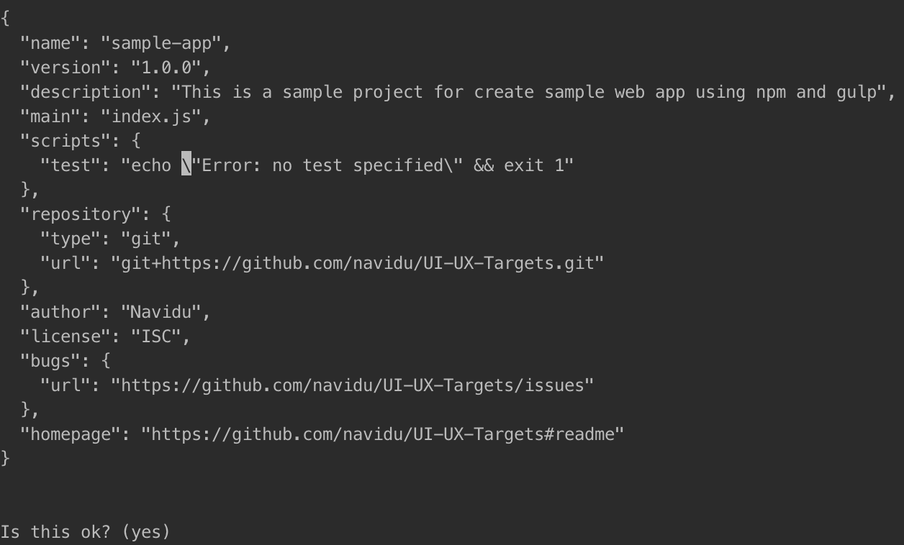

# How to build a web app using node npm and gulp
- This is a sample project for build a static web site using npm (yarn, if you need) and gulp.
- Fallow this steps to build your web application.
- In here, some of task describe with points

### Creating a gulp project
- first create a project using npm
```shell
npm init
```
- After that you have to fill this section with information like this.

- If done, press enter.

### Install Gulp