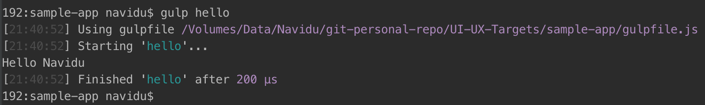

# How to build a web app using npm and gulp
- This is a sample project for build a static web site using npm (yarn, if you need) and gulp.
- Fallow this steps to build your web application.
- In here, some of task describe with points

## Step -1 Create a project
- First create a project using npm
```shell
npm init
```
- If you need to create the project using yarn, first install yarn
```shell
npm install -g yarn
```
- Then,
```shell
yarn init
```
- After that you have to fill this section with information like this.

- If done, press enter.

## Add, Updating and Removing packages
- In here shows an example of each and every command with gulp
### Add Package
- npm:
```shell
npm install [package-name]
```
```shell
npm install gulp
```

- yarn:
```shell
yarn add [package-name]
```
```shell
yarn add gulp
```

#### - Add Package with version
- npm:
```shell
npm install [package-name]@[version-or-tag]
```
```shell
npm install gulp@4.0
```

- yarn:
```shell
yarn add [package-name]@[version-or-tag]
```
```shell
yarn add gulp@4.0
```
#### - If you need to check version of the package,
- npm:
```shell
npm install [package-name]@^
```
```shell
npm update gulp@^
```

- yarn:
```shell
yarn add [package-name]@^
```
```shell
yarn add gulp@^
```
### Upgrade the package
- npm:
```shell
npm update [scope] [package-name]
```
```shell
npm update -g gulp
```

- yarn:
```shell
yarn upgrade [package-name]@[version-to-update]
```
```shell
yarn upgrade gulp@4.0
```
### Delete the package
- npm:
```shell
npm uninstall [scope] [package-name]@[version-if-have]
```
```shell
npm uninstall -g gulp@4.0
```

- yarn:
```shell
yarn remove [package-name]@[version-if-have]
```
```shell
yarn remove gulp@4.0
```

## Dependencies
- There are three types of dependencies.
    - --dev
    - --peer
    - --optional
- Mainly we using dev dependency as well.
- For our final output, If we no need some of packages such as, gulp, gulp-sass etc. save in the dev dependency. So we use this command for that.
- Refer Step - 2 Install Gulp for the example
- npm:
```shell
npm install [package-name] --save-dev
```
```shell
npm install [package-name]@[version-or-tag]  --save-dev
```

- yarn:
```shell
yarn add [package-name] --dev
```
```shell
yarn add [package-name]@[version-or-tag] --dev
```

## Step - 2 Install Gulp
- npm:
```shell
npm install gulp --save-dev
```

- yarn:
```shell
yarn add gulp --dev
```
- After this, gulp folder install in to the package under node_module folder.

## Step - 3 Determining Folder Structure
- Create your folder structure like this

```puml
    |-sample-app
      |- src/
          |- scss/
            |-partials
            |-style.scss
          |- fonts/
          |- img/
          |- html/
            |-partials
            |-index.html
          |- js/
      |- gulpfile.js
      |- node_modules/
      |- package.json
```
- src: This is the source folder of application. All the source file for build the application is in this folder.
- gulpfile.js: All gulp task is in this java script
- node_modules: All packages in this folder
- package.json: All dependency for build node_modules are in this json

## Create gulpfile.js file
### Write my first gulp task
```JavaScript
var gulp = require('gulp'); //variable
```
- The require statement tells Node to look into the `node_modules` folder for a package named `gulp`. Once the package is found, we assign its contents to the variable `gulp`
```JavaScript
//function for build the tasks
gulp.task('task-name', function() {
  // Stuff here
});
```

- `task-name` refers to the name of the task, which would be used whenever you want to run a task in Gulp. You can also run the same task in the command line by writing `gulp task-name`.

```JavaScript
gulp.task('hello', function() {
  console.log('Hello Navidu');
});
```

- Your out come will be like this:


```JavaScript
gulp.task('task-name', function () {
  return gulp.src('source-files') // Get source files with gulp.src
    .pipe(aGulpPlugin()) // Sends it through a gulp plugin
    .pipe(gulp.dest('destination')) // Outputs the file in the destination folder
})
```

- As you can see, a real task takes in two additional gulp methods — `gulp.src` and `gulp.dest`.
- `gulp.src` tells the Gulp task what files to use for the task, while `gulp.dest` tells Gulp where to output the files once the task is completed.

## Step - 4 Write a task for SCSS

- Install sass using npm:
```shell
npm install gulp-sass --save-dev
```

```JavaScript
var sass = require('gulp-sass'); //requires the gulp-sass plugin

gulp.task('scss', function(){
    return gulp.src('src/scss/**/*.scss') // refer "Globbing in Node" title
        .pipe(sass())
        .pipe(gulp.dest('dist/css'))
});
```
- Run scss task using `gulp scss`
- You have a new folder call dist and under that folder have css folder with style.css
- Now you have new folder call dist and your file order will be like this

```puml
    |-sample-app
      |- dist/
          |- css/
            |-style.css
      |- src/
          |- scss/
            |-partials
            |-style.scss
          |- fonts/
          |- img/
          |- html/
            |-partials
            |-index.html
          |- js/
      |- gulpfile.js
      |- node_modules/
      |- package.json
```

## Globbing in Node
- `*.scss` : any file match ending with `.scss`
-  `**/*.scss` : any file match ending with `.scss` in the root folder
- `!not-me.scss` : not execute
-  `*.+(scss|sass)` : multiple pattern from root folder (`.scss` files or `.sass` files)

## Step - 5 Watching changeable files changes
- Write a function for watch task. It go and check every changeable files such as custom JavaScripts, SCSS and HTML file changes and update.
```JavaScript
gulp.task('watch', function(){
    gulp.watch('src/scss/**/*.scss', ['scss']);
});
```
- If you run the  watch task, it is waiting for another changes of your files like this.

- If there is an update on your files it will update the files in dist folder. (Did a changes of scss file)


## Step - 5 Write a task for HTML
- Create an `index.html` file in html folder under `src` folder.
- Haven't any gulp plugins for generate HTML. So directly put the `.html` files to `dist` folder.
- Default `.html` file is `index.html`.
```JavaScript
gulp.task('html', function(){
    return gulp.src('src/html/*.html')
        .pipe(gulp.dest('dist'));
});
```
- If run this `html` task, `dist` folder will create a `html` folder and `index.html` file is will be there.
- So this file also a more changeable file and have to add it to the `watch` task.
- So first build `html` task and then build `watch` task.

## Step - 6 Create the tasks build function
- Now, we have three `gulp` tasks.
- We have to build task by task, First `scss` task, `html` task and last `watch` task.
- If we have more tasks, it is hard to run. So create a `build` task to build all tasks in the project.
```JavaScript
var runSequence = require('run-sequence'); // need to run all sequence

gulp.task('build', function(callback){
    runSequence(
        ['scss', 'html']
    );
});
```
- Install `run-sequence` plugin as a dev dependency using:
```shell
npm install run-sequence  --save-dev
```
- `build` task is for build the `scss` or `js` or `html` or other things to build the project.
- All the building task are in an array.
- `watch` task is not build any thing. So now, first run `build` task and the run `watch` task.

## Step - 7 Create a new `dist` folder when project `build`
- When the `watch` task running, code will override on the old code. Some time it will occurred the errors.
- So we have to create a task for clear the `dist` folder when project build
```JavaScript
var del = require('del');//delete dist folder

gulp.task('clean:dist', function () {
    return del.sync('dist');
});
```
- Install `del` plugin as a dev dependency use for clearing the folder:
```shell
npm install del --save-dev
```
- And change your `build` function like this:
```JavaScript
gulp.task('build', function(callback){
    runSequence('clean:dist', ['scss', 'html']
    );
});
```
- When you run `build` function run the `clean:dist` function as well as other tasks in the array.

## Step - 8 Create a task for auto browser refreshing
- This is an additional one for the browser refreshing after each and every changes.
```JavaScript
var browserSync = require('browser-sync').create(); //for the browser sync

gulp.task('browserSync', function(){
    browserSync.init({
        server:{
            baseDir: 'dist'
        }
    })
});
```
- Browser Sync works with Gulp, so we don't have to use a plugin.
- Install `browser-sync` as a dev dependency use for clearing the folder:
```shell
npm install browser-sync --save-dev
```
- If you run the `browserSync` task, you can watch a new tab on your default browser of the `index.html`.
- Also, you have to change your `scss` and `html` tasks like this:
```JavaScript
//for css
gulp.task('scss', function(){
    return gulp.src('src/scss/**/*.scss')
        .pipe(sass())
        .pipe(gulp.dest('dist/css'))
        .pipe(browserSync.reload({
            stream:true
        }))
});

//for html
gulp.task('html', function(){
    return gulp.src('src/html/*.html')
        .pipe(gulp.dest('dist'))
        .pipe(browserSync.reload({
            stream: true
        }));
});
```
- Because of when some changes on the files, the browser will refresh automatically.
- But please remember, when you do some changes on yor files, this browser never automatically refresh for the changes. For the new changes, you have to run `watch` task.

## Step - 9 Create the default task
- Now we can identify our default task must be `watch` and `browserSync` tasks.
- So or default task is like this:
```JavaScript
gulp.task('default', function (callback) {
    runSequence(['watch', 'browserSync'],
        callback
    );
});
```

## Step - 10 Write a task for Bootstrap
- Write a task call `getbootstrap`.
- Install `bootstrap` not as  a dev dependency. Because of its need to view the project correctly.
```shell
npm install bootstrap
```
- Its install the latest version of the `bootstrap`
- After that the task go and check is that `bootstrap.scss` on the `node_module` `scss` folder.
- If yes, put that to `sass` plugin and generate the `css` and send the compiled version to the `dist/css` folder.
```JavaScript
gulp.task('getbootstrap', function(){
    return gulp.src('node_modules/bootstrap/scss/bootstrap.scss')
        .pipe(sass())
        .pipe(gulp.dest('dist/css'));
});
```
- Add your `getbootstrap` task into the `build` function.
```JavaScript
gulp.task('build', function(callback){
    runSequence('clean:dist', ['scss', 'html', 'getbootstrap']
    );
});
```
- Now build the project using `gulp build` and run `gulp` task.

## Step - 11 Write same tasks in one function
- `scss` and `getbootstrap` are same tasks for build customs `style.css` and `bootstrap.css`.
- We can create all two functions as one function like this:
```JavaScript
var merge = require('merge-stream'); // merge two tasks and return

gulp.task('scss', function(){
    //take vendor css
    var vendorStreamCss = gulp.src(['node_modules/bootstrap/scss/bootstrap.scss'])
        .pipe(sass())
        .pipe(gulp.dest('dist/css'));

    //take app css
    var appStreamCss =  gulp.src('src/scss/**/*.scss')
        .pipe(sass())
        .pipe(gulp.dest('dist/css'))
        .pipe(browserSync.reload({
            stream:true
        }));

    return merge(vendorStreamCss, appStreamCss);
});
```
- Create two variables for `vendorStreamCss` and `appStreamCss` (`custom css`). Pass the `src` array values to that two variables and `return` it.
- On this return time, we have to merge it. But out puts are two different files.
- So we have to install `merge-stream` plugin for that as a dev dependency.
```shell
npm install merge-stream --save-dev
```
- Remove `getbootstrap` task from `build` function.
```JavaScript
gulp.task('build', function(callback){
    runSequence('clean:dist', ['scss', 'html']
    );
});
```
## Step - 12 Write a task for Js
- This is same as Step 11.
- `vendorStreamJs` have all vendor`js` files in `node_modules` folder have as an an array.
```JavaScript
var concat = require('gulp-concat');//for css and js
var uglify = require('gulp-uglify');//for css and js

gulp.task('js', function(){
    // Concatenate vendor scripts
    var vendorStreamJs = gulp.src([
        'node_modules/jquery/dist/jquery.min.js',
        'node_modules/popper.js/dist/umd/popper.min.js',
        'node_modules/bootstrap/dist/js/bootstrap.min.js'
    ])
        .pipe(concat('vendors.js'))
        .pipe(gulp.dest('dist/js'));

    // Concatenate AND minify app sources
    var appStreamJs = gulp.src(['src/js/*.js'])
        .pipe(concat('index.js'))
        .pipe(uglify())
        .pipe(gulp.dest('dist/js'))
        .pipe(browserSync.reload({
            stream:true
        }));

    return merge(vendorStreamJs, appStreamJs);
});
```
- There is a `gulp` plugin call `gulp-concat`. That means all vendors' `js` files include to one `JavaScript` file. Install `gulp-concat`as a dev dependency:
```shell
npm install gulp-concat --save-dev
```
- As well as there is another `gulp` plugin call `uglify` for create the mini version of `JavaScript` file. Install `gulp-uglify`as a dev dependency
```shell
npm install gulp-uglify --save-dev
```
- If you need`jQuery` and `popper.js` `js` files install both NOT as a dev dependency.
```shell
npm install jquery
```
```shell
npm install popper.js
```
- Source paths of the `.min` files of `jquery` and `popper.js` `js` are refer the `js` function under `vendorStreamJs` variable.
- Add `js` task to you4 `default` function.